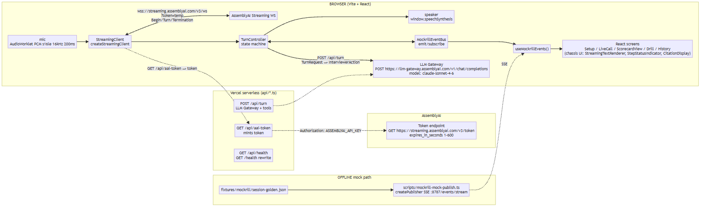

# Mockrill — Realtime AI Mock-Interview Voice Coach

Junior bootcamp graduates rehearse spoken technical screens with a realtime voice agent that quotes exact moments (07:42) and re-drills the weakest answer by voice; why AI why now: only realtime voice can observe spoken behavior it coaches.

## Quickstart (90 seconds)

```sh
npm ci
cp .env.example .env   # then set ASSEMBLYAI_API_KEY in .env
npm run dev             # or npm run build && npm run preview
```

Copy `.env.example` to `.env`, set `ASSEMBLYAI_API_KEY` in `.env`, then `npm run dev` (Vite on https or localhost) and open http://localhost:5173.

## Hosted URL

`https://<app>.vercel.app` — production deployment (PUBLIC_URL from DP-DEPLOY). Placeholder before deploy: `https://mockrill.vercel.app` — deployed URL after npm run deploy.

## Architecture



See `docs/chassis-modules.mmd` for module provenance (the two diagrams are complementary — runtime data flow vs module provenance).

## Offline demo (no key)

```sh
npm run build
npm run preview -- --port 4173 &
npm run mock:publish              # vite-node scripts/mockrill-mock-publish.ts SSE :8787/events/stream
open http://localhost:4173?source=stream
```

`npm run mock:publish` replays `fixtures/mockrill/session-golden.json` via SSE at `:8787/events/stream` and the app at `http://localhost:4173?source=stream` renders the same screens without a live key.

## AssemblyAI features used (Application-of-Technology evidence)

- Streaming STT (AssemblyAI Realtime): `speech_model: universal-3-5-pro`, `sample_rate: 16000`, `encoding: pcm_s16le`, `format_turns`, `end_of_turn_confidence_threshold: 0.4`, `vad_threshold: 0.2`, `min_turn_silence`, `max_turn_silence: 1536`, `interruption_delay`, `mode: balanced`, `keyterms_prompt`
- Token: `GET https://streaming.assemblyai.com/v3/token` with `Authorization: <ASSEMBLYAI_API_KEY>` and `expires_in_seconds` (1–600 short-lived token minted by `GET /api/aai-token`)
- LLM Gateway: `POST https://llm-gateway.assemblyai.com/v1/chat/completions` with `model: claude-sonnet-4-6` fallback `qwen3.5-4b-32k-fast`, `tools` JSON-Schema, `tool_choice`
- Voice output: `window.speechSynthesis` (no TTS vendor)

## License

MIT — see LICENSE (2026 Mockrill Contributors)

## Disclosure

See disclosure.md (generated via provo) and architecture-summary.md
