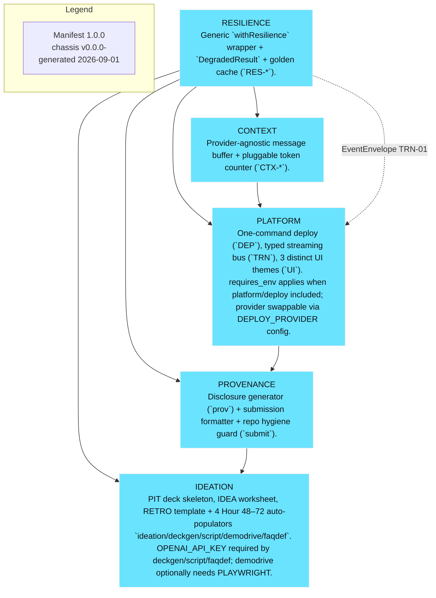

# Architecture — How it works

<!-- SLOT 06 -->
Engine-layer spec for planner pipeline: capture mic → AssemblyAI Voice Agent API (or Realtime STT WebSocket wss://streaming.assemblyai.com/v3/ws + BYO LLM/TTS) streaming 16-bit mono PCM (or AAC) with VAD; LLM routing via JSON-Schema tools (select_question, score_answer, tag_filler); TTS voice output; client handles barge-in and turn_is_formatted finalization. Data flow: audio chunks → Turn events → LLM tool calls → rubric store → scorecard renderer quoting words[start,end] timestamps. UI states: pre-call setup, live transcript ticking, scorecard (timestamp quotes + re-drill button), history. Prompt boundaries: deconstruction/synthesis prompts domain-free; domain enters via brief/catalog only. Corpus needs: role-specific question banks (STAR, behavioral), scoring rubrics, filler-word lexicon. Contracts: MediaMessage shape for STT, DegradedResult for resilience fallback (golden cached Turns). No fixed Engine topology pre-decided — capability boundary only.

Module emphasis (advisory): Consider media/stt as primary ingestion (Universal-3 Pro) and media/tts for Path B; resilience wrapper on every AssemblyAI WebSocket/TTS call with timeout 15000ms, retries 1, fallback chain cache→none, plus RES_FORCED_DEGRADED kill switch. Context buffer for long voice conversations to avoid token overflow. Cost guardrail around every LLM/tool call. Platform transport (TRN) + mock envelopes for live transcript ticking UI, deploy via Vercel (VERCEL_TOKEN/PROJECT_ID, HTTPS for mic). Provenance disclosure via PROVO. Ideation deck/script/FAQ/demodrive for pitch. These are advisory suggestions only — the Assembly Advisory module decides the manifest; do not embed manifest_version/included/components blocks here.

<!-- /SLOT 06 -->
