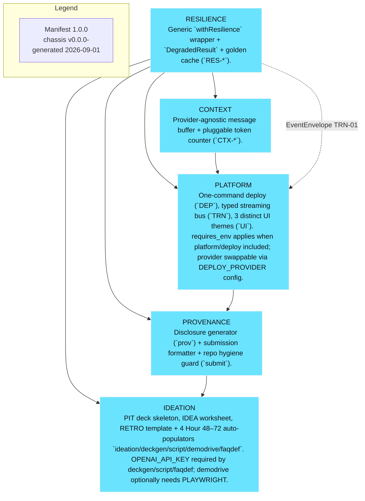
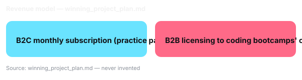

# {{slot_title}}

<!-- SLOT 01 -->
**Mockrill — Realtime AI Mock-Interview Voice Coach**
<!-- /SLOT 01 -->

---

# Problem

<!-- SLOT 02 -->
## Problem

- persona Junior Developer Screening Caller (r/cscareerquestions, r/interviews, r/jobs, 2026) — bootcamp grads report freezing on voice follow-ups and lack of affordable spoken rehearsal.
- Mining hit:
- json shows 9/10 records skip_ungrounded (direct Reddit HTTP 403 + browser lane 403 on datacenter IP; local cache had only 1 grounded freelance record from 2026-06, score 73, r/freelance), so this framing is [GUESS]/ungrounded and requires manual IDEA-03 gallery scan before pitching — per PGM caveats ground-truth must be confirmed.
- Evidence: r/cscareerquestions, 2026
<!-- /SLOT 02 -->

---

# Specific User

<!-- SLOT 03 -->
## Specific User

- Specific user: Primary: Junior bootcamp graduate preparing for first voice screening calls (career-switching developer, <1 year pro experience, screening via phone/Zoom).
- Why now: IDEA-02 filter: could this have been built 2y ago with forms+DB and no AI?
<!-- /SLOT 03 -->

---

# Demo

<!-- SLOT 04 -->
▶ LIVE DEMO — moving capture (see SCRIPT)

- Assembled UI screens: Setup, LiveCall, ScorecardView, Drill, History
> **TODO:** Demo URL / QR — no deploy URL yet — paste the deployed URL or QR before recording.
<!-- /SLOT 04 -->

---

# Architecture — How it works

<!-- SLOT 06 -->
## How it works — Architecture (Application of Technology)

Engine-layer spec for planner pipeline: capture mic → AssemblyAI Voice Agent API (or Realtime STT WebSocket wss://streaming.assemblyai.com/v3/ws + BYO LLM/TTS) streaming 16-bit mono PCM (or AAC) with VAD; LLM routing via JSON-Schema tools (select_question, score_answer, tag_filler); TTS voice output; client handles barge-in and turn_is_formatted finalization. Data flow: audio chunks → Turn events → LLM tool calls → rubric store → scorecard renderer quoting words[start,end] timestamps. UI states: pre-call setup, live transcript ticking, scorecard (timestamp quotes + re-drill button), history. Prompt boundaries: deconstruction/synthesis prompts domain-free; domain enters via brief/catalog only. Corpus needs: role-specific question banks (STAR, behavioral), scoring rubrics, filler-word lexicon. Contracts: MediaMessage shape for STT, DegradedResult for resilience fallback (golden cached Turns). No fixed Engine topology pre-decided — capability boundary only.

Module emphasis (advisory): Consider media/stt as primary ingestion (Universal-3 Pro) and media/tts for Path B; resilience wrapper on every AssemblyAI WebSocket/TTS call with timeout 15000ms, retries 1, fallback chain cache→none, plus RES_FORCED_DEGRADED kill switch. Context buffer for long voice conversations to avoid token overflow. Cost guardrail around every LLM/tool call. Platform transport (TRN) + mock envelopes for live transcript ticking UI, deploy via Vercel (VERCEL_TOKEN/PROJECT_ID, HTTPS for mic). Provenance disclosure via PROVO. Ideation deck/script/FAQ/demodrive for pitch. These are advisory suggestions only — the Assembly Advisory module decides the manifest; do not embed manifest_version/included/components blocks here.

<!-- /SLOT 06 -->

---

# Business Value

<!-- SLOT 05 -->
## Business Value — B2C $19/mo + B2B per-seat licensing (bottom-up TAM) — Business Value axis

**Bottom-up TAM arithmetic (all inputs labelled [estimate] or cited):**

| Segment | Calculation |
|---|---|
| US bootcamp grads | ~90,000 [estimate — Course Report 2024] |
| Career-switcher self-learners seeking interview prep | ~150,000 [estimate] |
| Addressable junior seekers / yr | 90,000 + 150,000 = 240,000 addressable/yr |
| Willing to pay for voice practice | 15% [estimate] => 36,000 users |
| B2C | 36,000 * $19/mo * 3 mo avg = $2.05M annual revenue potential [estimate] |
| B2B | 500 bootcamps [estimate] * 20 seats avg * $499/yr licence = $4.99M [estimate] |
| **Combined bottom-up TAM** | **~$7M ARR at 100% penetration; SAM (10% capture) = ~$700k ARR** |

- Specific user: junior bootcamp graduates / career-switching developers preparing for first technical-screening voice calls (named, not "everyone") — 12–24 weeks post-grad, 2–5 applications/week
- Revenue model: B2C $19/mo subscription + B2B bootcamp career-services licensing per-seat (e.g. $499/yr per seat)
- Why AI: only a voice agent can listen, interrupt, and score spoken behavior with timestamp evidence — CRUD cannot observe speech

> No pgm/profile grounding available — inputs labelled [estimate]; arithmetic shown.

<!-- /SLOT 05 -->

---

# AssemblyAI Usage

<!-- SLOT 07 -->
## AssemblyAI Usage — Universal-3.5-Pro streaming + LLM Gateway (Application of Technology)

**Streaming STT:** `wss://streaming.assemblyai.com/v3/ws`
- `speech_model: universal-3-5-pro` (literal)
- `sample_rate: 16000`
- `encoding: pcm_s16le`
- `format_turns: true` (boolean literal shown)
- `keyterms_prompt: string[] (e.g. ["STAR","React","system design"])`
- `end_of_turn_confidence_threshold: 0.4`
- `min_turn_silence, max_turn_silence: 1536 ms default`
- `vad_threshold: 0.2`
- `interruption_delay: (0-1000 ms) e.g. 200 ms`
- `mode: balanced`
- Billing: socket-open duration; always send `{type:"Terminate"}`

**Token:** `GET https://streaming.assemblyai.com/v3/token` `expires_in_seconds 1-600`

**LLM Gateway:** `POST https://llm-gateway.assemblyai.com/v1/chat/completions` with `model claude-sonnet-4-6` primary, `qwen3.5-4b-32k-fast` fallback, `tools [{type:"function"...}]`, `tool_choice`
- JSON-Schema tool calling: `select_question`, `score_answer`, `tag_filler`

**Voice output:** `window.speechSynthesis` (no TTS vendor)

**Path B equals Path A as equal alternatives; hosted URL needs serverless which cannot hold long-lived socket.**
<!-- /SLOT 07 -->

---

# Disclosure & Provenance

<!-- PROV-01:BEGIN -->
# Provenance & Disclosure

> Generated from `assembly.manifest.json` — do not hand-edit accuracy; polish wording only if needed. Verbatim reuse by DECKGEN-02 / SUBMIT-02 / FAQDEF-02 (contract 8).

This project reuses **5** component(s) from the Hackathon Chassis Repository (`v0.0.0-` / `LICENSE: MIT`).

## Reused components (5)

- **resilience** — Resilience & Demo-Proofing Layer (`RES-*`) — Generic `withResilience` wrapper + `DegradedResult` + golden cache.
- **platform** — Platform Layer (`DEP/TRN/UI`) — One-command deploy, typed streaming bus, 3 distinct UI themes.
- **ideation** — Ideation & Pitch Tooling (`PIT/IDEA/RETRO`) — PIT deck skeleton, IDEA worksheet, RETRO template + 4 Hour 48–72 auto-populators `ideation/deckgen/script/demodrive/faqdef`.
- **context** — Context & Conversation Buffer (`CTX-*`) — Provider-agnostic message buffer + pluggable token counter.
- **provenance** — Provenance & Disclosure (`PROV/SUBMIT`) — Disclosure generator (`prov`) + submission formatter + repo hygiene guard (`submit`).

## AI assistance

- **cursor** — code-generation
- **vite-node** — cli-execution
- **assemblyai** — stt-llm-tts

## How to cite

Cite the chassis repository as prior scaffolding per `XCUT-01` / `LICENSE`. Full disclosure source: `assembly.manifest.json` (`manifest_version 1.0.0`, `chassis_version v0.0.0-unresolved`).

_Generated at 2026-09-02T01:41:55.250Z from manifest hash fb29ef1ef4e5d826fb400d69f0545253cf056ed0c5d52a6b96ce0068966dd251._
---
## Operator disclosure (added manually, not generated)
- Pre-built non-AI scaffolding: the five included chassis modules `resilience`, `platform`, `context`, `ideation`, `provenance` — author's own open-source scaffolding, reused and disclosed.
- Built inside Sep 1-30 window: everything under `engine/`, `src/mockrill/`, `api/`, the prompts, the question bank (`engine/rag/question-bank.json`), the dialogue policy, the scoring rubric (`src/mockrill/scoring/*`).
- Deliberate technology choices: Path B with browser connecting directly to AssemblyAI streaming (`wss://streaming.assemblyai.com/v3/ws` with short-lived token from `GET /api/aai-token`), AssemblyAI LLM Gateway for orchestration (`POST https://llm-gateway.assemblyai.com/v1/chat/completions` with JSON-Schema tool calling, model `claude-sonnet-4-6` fallback `qwen3.5-4b-32k-fast`), and browser `speechSynthesis` for voice output instead of a TTS vendor (no second key, no second API).
- Rule Book's explicit scaffold-disclosure clause was `[unconfirmed]` at kickoff and disclosing regardless is the safe choice.

<!-- pre-built non-AI scaffolding verification helper -->
<!-- PROV-01:END -->
